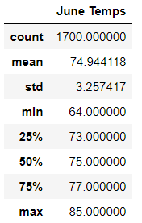
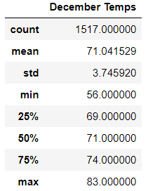
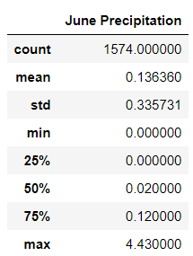
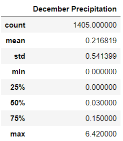

# surfs_up

## Overview of the Analysis

Presented here is an analysis of yearly weather trends in Hawaii to determine if a surf and ice cream shop is a sustainable year-round business. Specifically, this analysis compares temperature differences between June and December.

## Results

- June has an average daily temperature of 75 degrees.

- December is only slightly cooler, with an average daily temperature of 71.

- December has somewhat more variation in temperature than June, with a greater difference between its maximum and minimum temperatures, and a slightly higher standard deviation. The tables below contain summary statistics for both June and December.

   

## Summary

Comparing temperature data for June and December show only a small amount variation between the two months. Temperatures are warm in both months, with December daily averages only slightly lower than June's. These temperature trends suggest that it would be viable to operate the surf and ice cream shop on a year-round basis.

Further analysis might compare the average rainfall for June and December to create a more complete picture of weather conditions. A preliminary comparison of precipitation for the two months shows that December gets significantly more rain than June.  The following two tables compare daily precipitation for June and December:

  

While the temperature trends suggest that the business could be sustainable throughout the year, incorporating precipitation data complicates the picture. The cooler, rainier weather in December suggests less demand for ice cream and surfing gear in the winter months. 